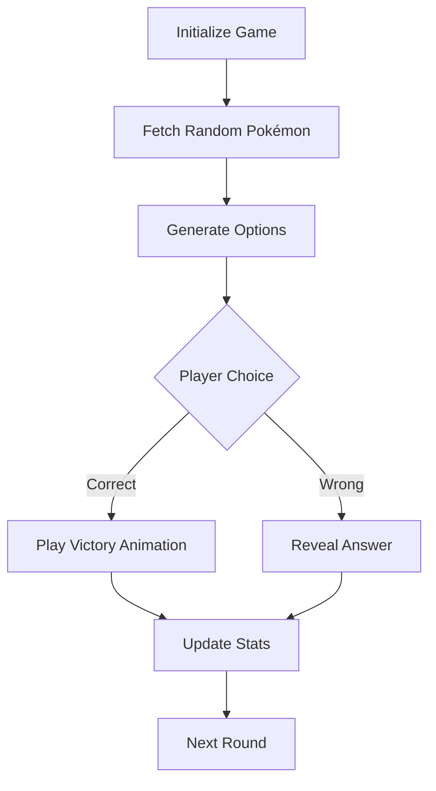

# 🎮 Guess Pokémon Game

[](https://vuejs.org/)[](https://tailwindcss.com/)[](https://opensource.org/licenses/MIT)


English | [简体中文](./README.zh-CN.md)

A fun Pokémon guessing game built with Vue 3, challenge yourself to identify Pokémon by their silhouettes!

## 🌐 Live Demo
[Play Now](https://vogadero.github.io/guess-pokemon/) | [Mirror Link](https://mirror-demo-url.com)

## ✨ Features
- 🎯 Random Pokémon silhouette challenges
- 📊 Real-time win/loss statistics
- 🎉 Victory confetti animation
- 🖌️ Tailwind CSS powered UI
- ⚡ Vue 3 reactive game logic
- 🧪 Vitest unit testing

## 🛠️ Tech Stack
- **Framework**: Vue 3 + TypeScript
- **Styling**: Tailwind CSS + PostCSS
- **Animation**: Canvas Confetti
- **Testing**: Vitest + Vue Test Utils
- **Build**: Vite 6
- **Linting**: ESLint + Prettier

## 📜 Data Sources
- [PokeAPI](https://pokeapi.co/) - Pokémon metadata
- [Pokédex](https://www.pokemon.com/us/pokedex/) - Images & silhouettes
- Custom algorithm for question generation

All data used for educational purposes under [PokeAPI Fair Use Policy](https://pokeapi.co/docs/v2#fairuse)

## 🚀 Quick Start

### Installation
```bash
npm install
```

### Development

```bash
npm run dev
```

### Production Build

```bash
npm run build
```

### Preview

```bash
npm run preview
```

### Testing

```bash
npm run test:unit
```

### Formatting

```bash
npm run format
```

## 📂 Project Structure

```markdown
guess-pokemon/
├── src/
│   ├── modules/          # Feature modules
│   ├── hooks/            # Custom hooks
│   ├── assets/           # Static assets
│   ├── App.vue           # Root component
│   └── main.ts           # Entry file
├── tailwind.config.js    # Tailwind config
└── vite.config.ts        # Vite config
```

## 🔍 Technical Implementation



## 🌟 Key Features

1. **Architecture**:

   ```mermaid
   graph LR
       UI[Vue Components] --Events--> Logic[Game Hook]
       Logic --State--> Store[Reactive Store]
       Store --Updates--> UI
       API[PokeAPI] --Data Fetching--> Logic
   ```

2. **Game Logic**: `usePokemonGame` composition API

3. **Performance**: Dynamic loading + Web Workers

4. **Animations**: Canvas confetti effects

5. **Responsive Design**: Mobile-first layout

6. **Type Safety**: Strict TypeScript definitions

7. **Error Handling**: Three-level fallback system

8. **Accessibility**: Keyboard navigation & ARIA

## 🔧 Requirements

- Node.js 18+
- Recommended: pnpm

## 🤝 Contributing

1. Fork the repository
2. Create feature branch (`git checkout -b feat/amazing-feature`)
3. Commit changes (`git commit -m 'Add amazing feature'`)
4. Push branch (`git push origin feat/amazing-feature`)
5. Open Pull Request

## MIT License

Licensed under [MIT License](vscode-webview://0khkdn2j8525463bq40sgktn2gqlie9imkvuhie6p6fkhsp7guor/LICENSE)