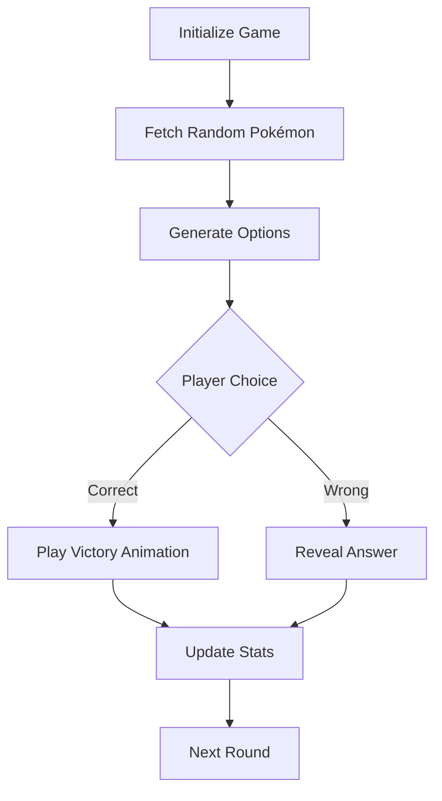
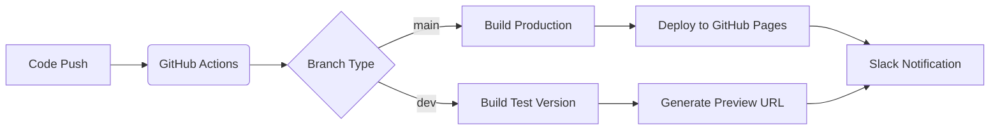

# 🎮 Guess Pokémon Game


## 📌 Project Badges

| Category                  | Quantity | Badge List                                                   |
| :------------------------ | :------: | :----------------------------------------------------------- |
| **Framework**             |    2     | [](https://vuejs.org/)[](https://www.typescriptlang.org/) |
| **Build Tools**           |    2     | [](https://vitejs.dev/)[](https://nodejs.org/) |
| **Test Tools**            |    3     | [](https://vitest.dev/)[](https://www.cypress.io/)[](https://vogadero.github.io/guess-pokemon/coverage) |
| **Styling Tools**         |    3     | [](https://tailwindcss.com/)[](https://postcss.org/)[](https://www.kirilv.com/canvas-confetti/) |
| **Code Quality**          |    3     | [](https://eslint.org/)[](https://prettier.io/)[](https://github.com/Vogadero/guess-pokemon/network/dependencies) |
| **Package**               |    1     | [](https://npmjs.org/) |
| **HTTP Client**           |    1     | [](https://axios-http.com/) |
| **CI/CD**                 |    5     | [](https://github.com/Vogadero/guess-pokemon/actions)[](https://github.com/Vogadero/guess-pokemon/actions/workflows/ci.yml) [](https://github.com/Vogadero/guess-pokemon/actions/workflows/codeql.yml) [](https://github.com/Vogadero/guess-pokemon/commits/main)[](https://codecov.io/gh/Vogadero/guess-pokemon) |
| **Safety Compliance**     |    7     | [](https://snyk.io/test/github/Vogadero/guess-pokemon)[](https://github.com/Vogadero/guess-pokemon/security/dependabot) [](vscode-webview://0khkdn2j8525463bq40sgktn2gqlie9imkvuhie6p6fkhsp7guor/.github/SECURITY.md)[](https://bestpractices.coreinfrastructure.org/projects/10522) [](https://github.com/ossf/best-practices)[](https://securityscorecards.dev/viewer/?uri=github.com/Vogadero/guess-pokemon)[](https://github.com/Vogadero/guess-pokemon/security/code-scanning) |
| **Version Release**       |    2     | [](https://github.com/Vogadero/guess-pokemon/releases)[][https://vogadero.github.io/guess-pokemon/ ][](https://vogadero.gitee.io/guess-pokemon/) |
| **Community Interaction** |    4     | [](https://join.slack.com/t/T08PVT37G4W/shared_invite/zt-34l17yfuq-40VKJO_bTcFyiFfFfNfbSw)[](https://github.com/Vogadero/guess-pokemon/discussions)[](https://github.com/Vogadero/guess-pokemon/stargazers)[](https://github.com/Vogadero/guess-pokemon/network/members) |
| **License**               |    1     | [](https://github.com/Vogadero/guess-pokemon/blob/main/LICENSE) |
| **Project Maintenance**   |    2     | [](https://github.com/Vogadero/guess-pokemon/issues)[][https://github.com/sponsors/Vogadero ] |

English | [简体中文](./README.zh-CN.md)

A fun Pokémon guessing game built with Vue 3, challenge yourself to identify Pokémon by their silhouettes!

## 🌐 Live Demo
[Play Now](https://vogadero.github.io/guess-pokemon/) | [Mirror Link](https://vogadero.gitee.io/guess-pokemon/)

## ✨ Features
- 🎯 Random Pokémon silhouette challenges
- 📊 Real-time win/loss statistics
- 🎉 Victory confetti animation
- 🌐 Multi-language support (中文/English/日本語)
- 🎨 Theme customization with 12 gradient styles
- ⚙️ Advanced settings:
  - 🕹️ Game modes (Normal/Timed)
  - 🕰️ Trigger delay configuration
  - 🧬 Generation selection
  - 🔍 Attribute feature toggle
- 🥚 Easter egg system:
  - ✨ Golden envelope animation
  - 🌀 Vortex particle effects
  - 🏮 Ancient scroll reveal
  - 🎖️ Master Badge awarding
- 🖌️ Tailwind CSS powered UI
- ⚡ Vue 3 reactive game logic
- 🧪 Vitest unit testing

## 🛠️ Tech Stack
- **Framework**: Vue 3 + TypeScript
- **Styling**: Tailwind CSS + PostCSS
- **Animation**: Canvas Confetti
- **Testing**: Vitest + Vue Test Utils
- **Build**: Vite 6
- **Linting**: ESLint + Prettier

## 📜 Data Sources
- [PokeAPI](https://pokeapi.co/) - Pokémon metadata
- [Pokédex](https://www.pokemon.com/us/pokedex/) - Images & silhouettes
- Custom algorithm for question generation

All data used for educational purposes under [PokeAPI Fair Use Policy](https://pokeapi.co/docs/v2#fairuse)

## 🚀 Quick Start

### Installation
```bash
npm install
```

### Development

```bash
npm run dev
```

### Production Build

```bash
npm run build
```

### Preview

```bash
npm run preview
```

### Testing

```bash
npm run test:unit
```

### Formatting

```bash
npm run format
```

## 📂 Project Structure

```markdown
guess-pokemon/
├── src/
│   ├── modules/          # Feature modules
│   ├── hooks/            # Custom hooks
│   ├── assets/           # Static assets
│   ├── App.vue           # Root component
│   └── main.ts           # Entry file
├── tailwind.config.js    # Tailwind config
└── vite.config.ts        # Vite config
```

## 🔍 Technical Implementation



## 🌟 Key Features

1. **Architecture**:

   ```mermaid
   graph LR
       UI[Vue Components] --Events--> Logic[Game Hook]
       Logic --State--> Store[Reactive Store]
       Store --Updates--> UI
       API[PokeAPI] --Data Fetching--> Logic
   ```

2. **Game Logic**: `usePokemonGame` composition API

3. **Performance**: Dynamic loading + Web Workers

4. **Animations**: Canvas confetti effects

5. **Responsive Design**: Mobile-first layout

6. **Type Safety**: Strict TypeScript definitions

7. **Error Handling**: Three-level fallback system

8. **Accessibility**: Keyboard navigation & ARIA

## 🔧 Requirements

- Node.js 18+
- Recommended: pnpm

## 🚀 Automated Deployment


- **Key Features**:
  - **Dual-environment deployment**: main branch auto-deploys to production, dev branch generates preview links
  - **Smart caching**: Dependency caching accelerates CI workflows (≈40% build time reduction)
  - **Security checks**: Automatic dependency vulnerability scanning (npm audit)
  - **Notification system**: Deployment results sync to Slack channel in real-time

## ⚙️ Deployment Process
```bash
# Local development workflow
git checkout -b feat/new-feature   # Create feature branch
npm run dev                        # Local development

# Commit changes
git commit -m "feat: add new feature module"
git push origin feat/new-feature

# Automatically triggers after PR creation:
# 1. Unit Tests → 2. E2E Tests → 3. Security Scanning → 4. Preview Deployment
```

## 🧮 Quality Assurance

- **Code Standards**: ESLint + Prettier + Commitlint
- **Test Coverage**: 
  - Unit Testing: Vue component core logic (Vitest)
  - E2E Testing: Full user workflows (Cypress)
  - Visual Testing: Storybook component library
- **Security Scanning**: Dependabot + npm audit
- **Performance Monitoring**: Lighthouse CI integration

## 🤝 Contributing

1. Fork the repository
2. Create feature branch (`git checkout -b feat/amazing-feature`)
3. Commit changes (`git commit -m 'Add amazing feature'`)
4. Push branch (`git push origin feat/amazing-feature`)
5. Open Pull Request

## MIT License

Licensed under [MIT License](vscode-webview://0khkdn2j8525463bq40sgktn2gqlie9imkvuhie6p6fkhsp7guor/LICENSE)