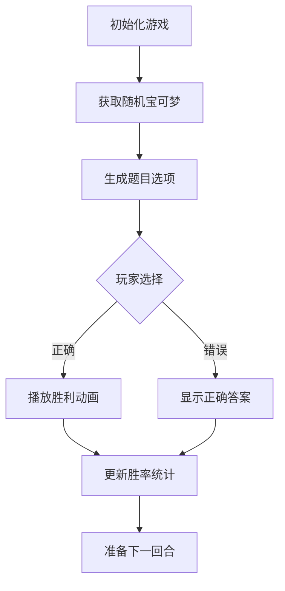

# 🎮 Guess Pokémon Game

[](https://vuejs.org/)[](https://tailwindcss.com/)[](https://opensource.org/licenses/MIT)

 

[English](./README.md) | 简体中文

一款基于Vue 3的趣味宝可梦猜谜游戏，通过识别剪影猜测正确的宝可梦，体验收集与挑战的乐趣！

## 🌐 在线演示
[立即体验](https://your-demo-url.com) | [备用链接](https://mirror-demo-url.com)

## ✨ 功能亮点
- 🎯 随机生成宝可梦剪影挑战
- 📊 实时胜负统计系统
- 🎉 胜利烟花庆祝动画
- 🖌️ Tailwind CSS驱动的精美UI
- ⚡ Vue 3响应式游戏逻辑
- 🧪 Vitest单元测试覆盖

## 🛠️ 技术栈
- **前端框架**: Vue 3 + TypeScript
- **UI框架**: Tailwind CSS + PostCSS
- **动画库**: Canvas Confetti
- **测试框架**: Vitest + Vue Test Utils
- **构建工具**: Vite 6
- **代码规范**: ESLint + Prettier

## 📜 数据来源
本游戏使用以下数据源：
- [PokeAPI](https://pokeapi.co/)：获取宝可梦基础数据
- [Pokédex](https://www.pokemon.com/us/pokedex/)：宝可梦图像及剪影
- 自定义生成算法：动态生成题目组合

所有数据仅用于教育目的，遵循[PokeAPI使用条款](https://pokeapi.co/docs/v2#fairuse)

## 🚀 快速开始

### 安装依赖
```bash
npm install
```

### 开发模式

```bash
npm run dev
```

### 生产构建

```bash
npm run build
```

### 预览生产版本

```bash
npm run preview
```

### 运行测试

```bash
npm run test:unit
```

### 代码格式化

```bash
npm run format
```

## 📂 项目结构

```markdown
guess-pokemon/
├── src/
│   ├── modules/          # 游戏功能模块
│   ├── hooks/            # 自定义Hook
│   ├── assets/           # 静态资源
│   ├── App.vue           # 根组件
│   └── main.ts           # 入口文件
├── tailwind.config.js    # Tailwind配置
└── vite.config.ts        # Vite配置
```

## 🔍 技术实现



## 🌟 实现亮点

1. **架构设计**：

   ```mermaid
   graph LR
       UI[Vue组件] --事件--> Logic[游戏逻辑Hook]
       Logic --状态--> Store[响应式状态]
       Store --更新--> UI
       API[PokeAPI] --数据获取--> Logic
   ```
2. **游戏逻辑封装**：使用`usePokemonGame`组合式API管理游戏状态
3. **性能优化**：动态加载宝可梦数据 + 图片懒加载，添加Web Workers处理数据解析
4. **动画系统**：Canvas实现的胜利烟花效果
5. **响应式设计**：移动端优先的UI布局
6. **类型安全**：严格的TypeScript类型定义
7. **错误处理**：实现三级容错机制（本地缓存 → 镜像API → 静态数据）
8. **可访问性**：支持键盘操作和ARIA标签

## 🔧 环境配置

需要Node.js 18+ 环境，推荐使用pnpm作为包管理器

## 🤝 贡献指南

1. Fork项目仓库
2. 创建特性分支 (`git checkout -b feature/amazing-feature`)
3. 提交修改 (`git commit -m 'Add some amazing feature'`)
4. 推送到分支 (`git push origin feature/amazing-feature`)
5. 提交Pull Request

## MIT License

本项目基于MIT许可证开源 - 详情请见[LICENSE](vscode-webview://0khkdn2j8525463bq40sgktn2gqlie9imkvuhie6p6fkhsp7guor/LICENSE)文件
