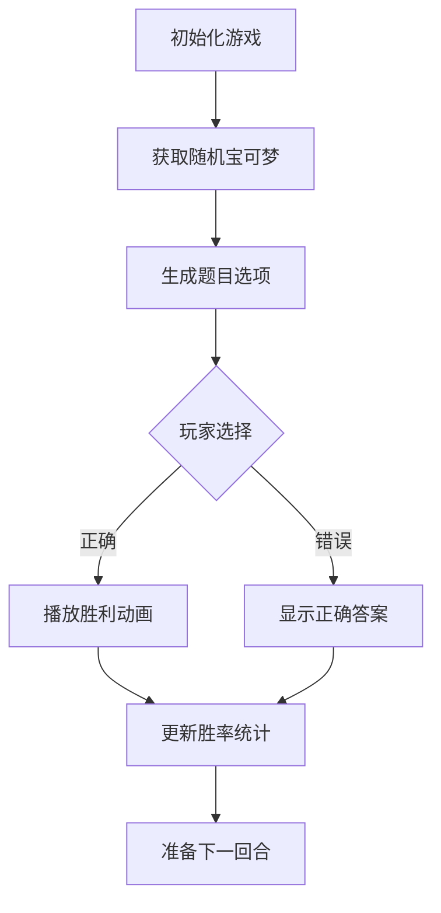
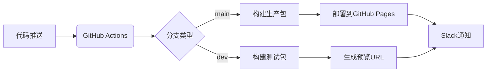

# 🎮 Guess Pokémon Game


## 📌 徽章

| 类别           | 数量 | 徽章列表                                                     |
| :------------- | :--: | :----------------------------------------------------------- |
| **前端框架**   |  2   | [](https://vuejs.org/)[](https://www.typescriptlang.org/) |
| **构建工具**   |  2   | [](https://vitejs.dev/)[](https://nodejs.org/) |
| **测试工具**   |  3   | [](https://vitest.dev/)[](https://www.cypress.io/)[](https://vogadero.github.io/guess-pokemon/coverage) |
| **样式工具**   |  3   | [](https://tailwindcss.com/)[](https://postcss.org/)[](https://www.kirilv.com/canvas-confetti/) |
| **代码质量**   |  3   | [](https://eslint.org/) [](https://prettier.io/)[](https://github.com/Vogadero/guess-pokemon/network/dependencies) |
| **包管理**     |  1   | [](https://npmjs.org/) |
| **HTTP客户端** |  1   | [](https://axios-http.com/) |
| **CI/CD**      |  5   | [](https://github.com/Vogadero/guess-pokemon/actions)[](https://github.com/Vogadero/guess-pokemon/actions/workflows/ci.yml)[](https://github.com/Vogadero/guess-pokemon/actions/workflows/codeql.yml)[](https://github.com/Vogadero/guess-pokemon/commits/main)[](https://codecov.io/gh/Vogadero/guess-pokemon) |
| **安全合规**   |  7   | [](https://snyk.io/test/github/Vogadero/guess-pokemon)[](https://github.com/Vogadero/guess-pokemon/security/dependabot)[](vscode-webview://0khkdn2j8525463bq40sgktn2gqlie9imkvuhie6p6fkhsp7guor/.github/SECURITY.md) [](https://bestpractices.coreinfrastructure.org/projects/10522)[](https://github.com/ossf/best-practices)[](https://securityscorecards.dev/viewer/?uri=github.com/Vogadero/guess-pokemon)[](https://github.com/Vogadero/guess-pokemon/security/code-scanning) |
| **版本发布**   |  2   | [](https://github.com/Vogadero/guess-pokemon/releases)[][https://vogadero.github.io/guess-pokemon/ ][](https://vogadero.gitee.io/guess-pokemon/) |
| **社区互动**   |  4   | [](https://join.slack.com/t/T08PVT37G4W/shared_invite/zt-34l17yfuq-40VKJO_bTcFyiFfFfNfbSw)[](https://github.com/Vogadero/guess-pokemon/discussions)[](https://github.com/Vogadero/guess-pokemon/stargazers)[](https://github.com/Vogadero/guess-pokemon/network/members) |
| **开源协议**   |  1   | [](https://github.com/Vogadero/guess-pokemon/blob/main/LICENSE) |
| **项目维护**   |  2   | [](https://github.com/Vogadero/guess-pokemon/issues)[][https://github.com/sponsors/Vogadero ] |

[English](./README.md) | 简体中文

一款基于Vue 3的趣味宝可梦猜谜游戏，通过识别剪影猜测正确的宝可梦，体验收集与挑战的乐趣！

## 🌐 在线演示

[立即体验](https://vogadero.gitee.io/guess-pokemon/) | [备用链接](https://vogadero.github.io/guess-pokemon/)

## ✨ 功能亮点
- 🎯 随机生成宝可梦剪影挑战
- 📊 实时胜负统计系统
- 🎉 胜利烟花庆祝动画
- 🌐 多语言支持 (中文/English/日本語)
- 🎨 12种渐变风格的主题定制
- ⚙️ 高级设置:
  - 🕹️ 游戏模式（普通/计时）
  - 🕰️ 触发延迟配置
  - 🧬 世代选择
  - 🔍 属性特征切换
- 🥚 彩蛋机制:
  - ✨ 金信封动画
  - 🌀 漩涡粒子效应
  - 🏮 古代卷轴揭示
  - 🎖️ 大师徽章授予
- 🖌️ Tailwind CSS驱动的精美UI
- ⚡ Vue 3响应式游戏逻辑
- 🧪 Vitest单元测试覆盖

## 🛠️ 技术栈
- **前端框架**: Vue 3 + TypeScript
- **UI框架**: Tailwind CSS + PostCSS
- **动画库**: Canvas Confetti
- **测试框架**: Vitest + Vue Test Utils
- **构建工具**: Vite 6
- **代码规范**: ESLint + Prettier

## 📜 数据来源
本游戏使用以下数据源：
- [PokeAPI](https://pokeapi.co/)：获取宝可梦基础数据
- [Pokédex](https://www.pokemon.com/us/pokedex/)：宝可梦图像及剪影
- 自定义生成算法：动态生成题目组合

所有数据仅用于教育目的，遵循[PokeAPI使用条款](https://pokeapi.co/docs/v2#fairuse)

## 🚀 快速开始

### 安装依赖
```bash
npm install
```

### 开发模式

```bash
npm run dev
```

### 生产构建

```bash
npm run build
```

### 预览生产版本

```bash
npm run preview
```

### 运行测试

```bash
npm run test:unit
```

### 代码格式化

```bash
npm run format
```

## 📂 项目结构

```markdown
guess-pokemon/
├── src/
│   ├── modules/          # 游戏功能模块
│   ├── hooks/            # 自定义Hook
│   ├── assets/           # 静态资源
│   ├── App.vue           # 根组件
│   └── main.ts           # 入口文件
├── tailwind.config.js    # Tailwind配置
└── vite.config.ts        # Vite配置
```

## 🔍 技术实现



## 🌟 实现亮点

1. **架构设计**：

   ```mermaid
   graph LR
       UI[Vue组件] --事件--> Logic[游戏逻辑Hook]
       Logic --状态--> Store[响应式状态]
       Store --更新--> UI
       API[PokeAPI] --数据获取--> Logic
   ```
2. **游戏逻辑封装**：使用`usePokemonGame`组合式API管理游戏状态
3. **性能优化**：动态加载宝可梦数据 + 图片懒加载，添加Web Workers处理数据解析
4. **动画系统**：Canvas实现的胜利烟花效果
5. **响应式设计**：移动端优先的UI布局
6. **类型安全**：严格的TypeScript类型定义
7. **错误处理**：实现三级容错机制（本地缓存 → 镜像API → 静态数据）
8. **可访问性**：支持键盘操作和ARIA标签

## 🔧 环境配置

需要Node.js 18+ 环境，推荐使用pnpm作为包管理器

## 🚀 自动化部署

- **实现特性**：
  - **双环境部署**：main 分支自动部署到生产环境，dev 分支生成预览链接
  - **智能缓存**：依赖缓存加速 CI 流程（节省约 40% 构建时间）
  - **安全检测**：自动进行依赖漏洞扫描 (npm audit)
  - **通知系统**：部署结果实时同步至 Slack 频道

## ⚙️ 部署流程

```bash
# 本地开发流程
git checkout -b feat/new-feature   # 创建新特性分支
npm run dev                        # 本地开发

# 提交变更
git commit -m "feat: 添加新特性模块"
git push origin feat/new-feature

# 创建 PR 后自动触发：
# 1. 单元测试 → 2. E2E测试 → 3. 安全扫描 → 4. 部署预览环境
```

## 🧮 质量保障

- **代码规范**: ESLint + Prettier + Commitlint
- **测试覆盖**: 
  - 单元测试: Vue组件核心逻辑 (Vitest)
  - E2E测试: 完整用户流程 (Cypress)
  - 可视化测试: Storybook 组件库
- **安全扫描**: Dependabot + npm audit
- **性能监控**: Lighthouse CI 集成

## 🤝 贡献指南

1. Fork项目仓库
2. 创建特性分支 (`git checkout -b feature/amazing-feature`)
3. 提交修改 (`git commit -m 'Add some amazing feature'`)
4. 推送到分支 (`git push origin feature/amazing-feature`)
5. 提交Pull Request

## MIT License

本项目基于MIT许可证开源 - 详情请见[LICENSE](vscode-webview://0khkdn2j8525463bq40sgktn2gqlie9imkvuhie6p6fkhsp7guor/LICENSE)文件
